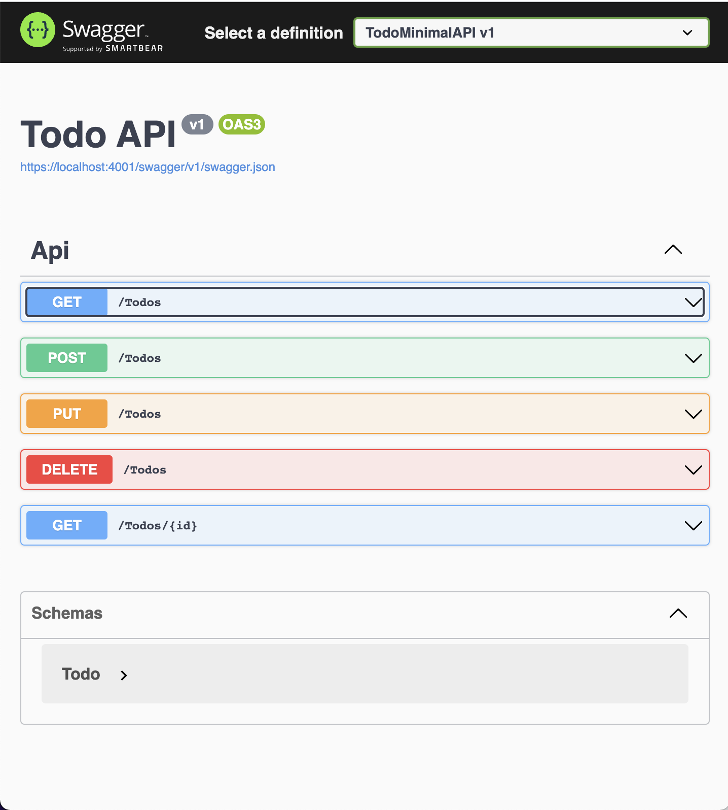

# Todo API

This repository is for educational purposes. Use it only as a reference.

This is a simple CRUP API to demostrate the use of `Net Core 6 framework`, and the minimal API, it uses also `Entity Framework Core`, with memory DB.

> Run with docker
```bash
docker-compose -f docker-compose-dev.yml up
```
> Or run with dotnet run
```
cd TodoMinimalAPI/
dotnet run
```
And browse to `https://localhost:4001/swagger/index.html`:


